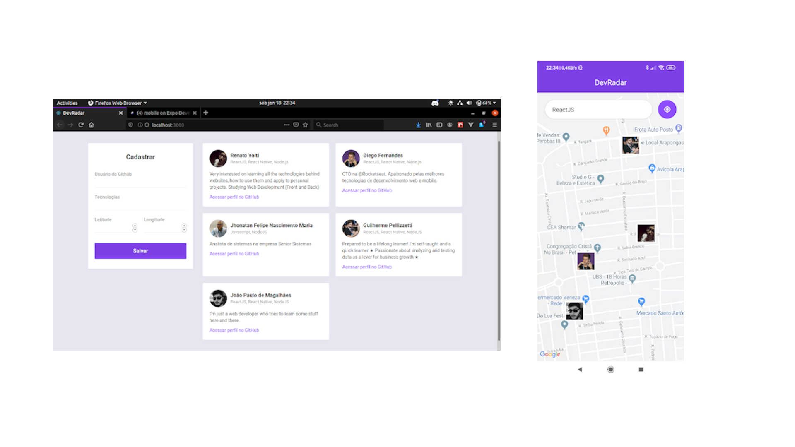

<h1 align=center>DevRadar</h1>

<p>An application to connect with other devs that utilize the same stack around your location.</p>



<h2 align=center>Getting Started</h2>

<h3>Requirements</h3>

<p>To run this project on your machine, you'll need to have installed:</p>

<ul>
  <li><a href="https://nodejs.org/en/">NodeJS</a></li>
  <li><a href="https://git-scm.com/">git</a></li>
  <li>package manager: <a href="https://yarnpkg.com/lang/en/">yarn</a> or <a href="https://www.npmjs.com/">npm</a></li>
  <li><a href="https://code.visualstudio.com/">vscode</a> or any other code editor you like</li>
  <li><a href="https://expo.io">Expo</a></li>
  <li><a href="https://www.mongodb.com/cloud/atlas">MongoDB Atlas</a> account (free)</li>
</ul>

<p>To configure MongoDB Atlas, you can follow this the steps on <a href="https://medium.com/@buka4chocksy/how-to-setup-mongodb-atlas-database-for-your-project-acd70b75a4e9">this article.</a></p>

<p>Install the expo app in your cellphone to execute this app, or if you preffer, install any android/ios emulator.</p>

<h3>Installing</h3>

<p>Open your terminal and clone this repository wherever you like with</p>

```git
git clone git@github.com:renatoyoiti/semanaomnistack10.git
```

<p>or</p>

```git
git clone https://github.com/renatoyoiti/semanaomnistack10.git
```

<p>Move to the backend folder inside the cloned repository</p>

```bash
cd catallog/backend
```

<p>Now run the package manager to install project dependencies</p>

```node
yarn
```

<p>or</p>

```node
npm install
```

<p>Open the backend folder in your code editor and edit the env_example file. Save it as .env and edit the enviroment variables accordingly to your MongoDB Atlas access.</p>

```javascript
module.exports {
  DB_USER: your_mongodbatlas_user,
  DB_PASS: your_mongodbatlas_password,
  DB_NAME: your_mongodbatlas_dbname,
}
```

<p>Then run</p>

```node
yarn dev
```

<p>to start the api server. If it is all set correctly, the api will be running.</p>

<p>Move to web and mobile folders and run these commands:</p>

<h5>Web</h5>

```node
cd ../web && yarn && yarn start
```

**or**

```node
cd ../web && npm install && npm start
```

<h5>Mobile</h5>

```node
cd ../mobile && yarn && yarn start
```

**or**

```node
cd ../mobile && npm install && yarn start
```

<p>If you are using expo on your cellphone, after running `yarn start` on mobile folder, it'll open expo cli on browser. Just scan de qrcode disponibilized there, and the app should be working by now.</p>

<p>In any android/ios emulator you'll need to run the following commands inside mobile folder:</p>

<h5>ios</h5>

```node
yarn ios
```

or

```node
npm run ios
```

<h5>android</h5>

```node
yarn android
```

or

```node
npm run android
```

